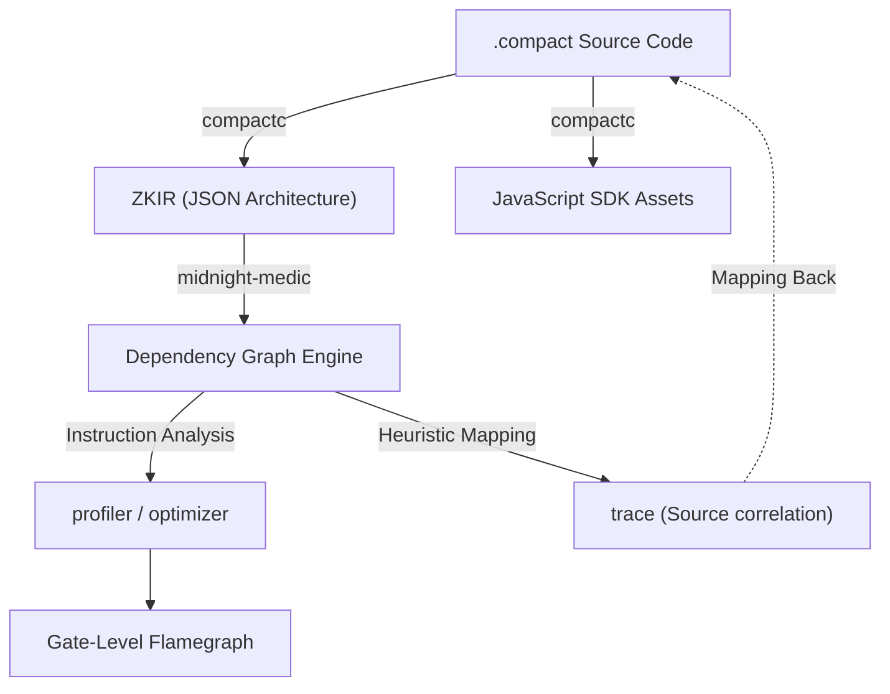

# midnight-medic

Environment diagnostics, advanced ZK analysis, and state observability for Midnight Network developers.

## Installation

```bash
npm install -g midnight-medic
# or run without installing:
npx midnight-medic doctor
```

## Commands

### Environment & Diagnostics

#### `midnight-medic doctor`

Runs a full local environment scan before you start your DApp. Checks: Docker daemon, port conflicts (6300, 8088, 9944), Indexer connectivity (preprod & preview networks), Proof Server health, and wallet balances via WALLET_SEED from .env.

**Options:**
- `--export` - Copy a Discord-friendly Markdown report to clipboard
- `--cwd <path>` - Working directory to scan (default: current directory)

```bash
midnight-medic doctor
midnight-medic doctor --export
```

**What it checks:**
- Docker daemon status and version
- Port availability (proof-server: 6300, indexer: 8088, node: 9944)
- Network connectivity to preprod and preview indexers
- Local proof server health endpoint
- Wallet balance (reads WALLET_SEED from .env and queries indexer)

#### `midnight-medic sync`

Detects version mismatches between your `@midnight-ntwrk/ledger-vX` SDK and your Docker Compose proof-server image. Scans all `*.yml` files in your project and validates against the official compatibility matrix.

**Options:**
- `--fix` - Automatically update docker-compose YAML files to compatible versions
- `--cwd <path>` - Working directory to scan (default: current directory)

```bash
midnight-medic sync
midnight-medic sync --fix
```

**Compatibility Matrix:**
| Ledger | Proof Server | SDK | Compiler |
| :--- | :--- | :--- | :--- |
| 8.0.3 | midnightntwrk/proof-server:8.0.3 | ^4.0.4 | 0.30.0 |
| 8.0.2 | midnightntwrk/proof-server:8.0.2 | ^4.0.3 | 0.29.0 |
| 7.1.0 | midnightntwrk/proof-server:7.1.0 | ^3.1.0 | 0.22.0 |

#### `midnight-medic lint [path]`

Statically analyzes your `.compact` files for common pre-compilation errors and anti-patterns.

**What it detects:**
- Missing or outdated pragma directives
- Variables used in ledger operations without `.disclose()`
- Constructor arguments that need to be passed in `deployContract()`
- Private variables in increment operations without disclosure

```bash
midnight-medic lint
midnight-medic lint ./contract/src
```

---

### Advanced ZK Analysis (ZKIR)

These commands reverse-engineer the compiled ZKIR (Zero-Knowledge Intermediate Representation) JSON files to provide deep insights into circuit behavior, costs, and failures.

#### `midnight-medic estimate [circuit-name]`

Pre-flight DUST cost calculator using ZKIR gate weights and the Midnight fee model. Provides detailed cost breakdown and estimates for both idle and busy network conditions.

**Options:**
- `--cwd <path>` - Working directory to search for ZKIR files

```bash
midnight-medic estimate castPrivateVote
midnight-medic estimate  # Shows all circuits
```

**Cost Breakdown:**
- Base fee (42 DUST)
- Circuit complexity (gate weight × multiplier)
- Public transcript size (8 DUST per public input)
- Ledger storage (25 DUST per write operation)

**Output includes:**
- Low/high DUST estimates based on network load
- Proof generation time estimate
- Circuit statistics (instructions, gate weight, inputs)
- Warnings for expensive operations

#### `midnight-medic optimize [path]`

Scans compiled `.zkir` files for redundancies and optimization opportunities. Uses dependency graph analysis to detect wasteful patterns.

**What it detects:**
- **Duplicate hashes** - Same `persistent_hash` called multiple times with identical inputs (30 gates each)
- **Redundant constraints** - Same variable constrained multiple times with `constrain_bits`
- **Deep branch chains** - Long sequences of `cond_select` operations (complex if/else trees)
- **Witness bloat** - Excessive `private_input` operations (>15 witnesses)
- **Large public transcripts** - Too many `public_input` reads (>20 operations)

```bash
midnight-medic optimize
midnight-medic optimize ./managed
```

**Output:**
- Per-circuit issue report with severity levels (critical/warn/info)
- Estimated gate savings for each optimization
- Actionable refactoring suggestions for your `.compact` code

#### `midnight-medic profile [path]`

Analyzes circuit weights by reverse-engineering ZKIR operation nodes. Generates a visual flamegraph showing the heaviest mathematical operations and estimates proof generation time.

**Options:**
- `--json` - Output raw profile data as JSON instead of visual flamegraph

```bash
midnight-medic profile
midnight-medic profile --json
```

**Opcode Cost Model:**
- `persistent_hash`: 30 gates (most expensive - Poseidon hash)
- `mul`: 12 gates (multiplicative constraint)
- `div_mod_power_of_two`: 10 gates
- `less_than`: 8 gates (range check)
- `private_input`: 8 gates (witness)
- `assert`: 6 gates (hard constraint)
- `add`/`sub`: 4 gates
- `cond_select`: 3 gates (if/else branch)

**Output includes:**
- Weight-based flamegraph (color-coded: green/yellow/red)
- Estimated proof time per circuit
- Top cost breakdown by opcode
- Optimization tips for heaviest circuits

#### `midnight-medic trace`

Live ZK proof failure monitor with circuit-level ZKIR trace and source hints. Tracks down cryptic proof failures by mapping runtime errors to ZKIR graphs and original `.compact` source code.

**Modes:**

**Live Monitor Mode** (default):
```bash
midnight-medic trace
midnight-medic trace --container my-proof-server
```
Streams Docker logs in real-time and analyzes failures as they happen.

**Post-Mortem Mode**:
```bash
midnight-medic trace --circuit castPrivateVote
```
Deep-analyzes a specific circuit's ZKIR without a live Docker session.

**Options:**
- `--circuit <name>` - Post-mortem analysis of a specific circuit
- `--container <name>` - Specify proof server container name manually
- `--cwd <path>` - Working directory to search for ZKIR and .compact files

**Error Detection:**
- **Constraint violations** - Failed `assert()` in circuit with ZKIR slot trace
- **Input mismatches** - Public transcript doesn't match circuit signature
- **Timeouts** - Proof generation exceeded time limit
- **Out of memory** - Proof server ran out of RAM
- **Unknown failures** - Invalid witness values

**Output includes:**
- Error type badge with severity
- Circuit name and instruction index
- ZKIR dependency graph showing which slots/operations led to failure
- Source code hints (heuristic mapping to `.compact` file)
- Suggested fixes with actionable commands

---

### State & Observability

#### `midnight-medic inspect`

Decrypts and explores your local LevelDB private state store. Automatically locates your `.env` for the `WALLET_SEED`, dynamically imports the Midnight SDK from your project's `node_modules`, and prints your decrypted private state in a structured, readable terminal tree.

**Options:**
- `--db <path>` - Path to LevelDB directory (auto-detected if not specified)
- `--cwd <path>` - Working directory to search for .env and db/ (default: current directory)

```bash
midnight-medic inspect
midnight-medic inspect --db ./private-state
```

**How it works:**
1. Reads `WALLET_SEED` from `.env` in your project
2. Auto-detects LevelDB directory (searches: `db/`, `private-state/`, `.private-state/`, `state/`, `data/private`)
3. Dynamically imports `@midnight-ntwrk/midnight-js-level-private-state-provider` from your local `node_modules`
4. Decrypts the state using your wallet seed
5. Pretty-prints the state as an indented tree with type annotations

**Output includes:**
- Nested object structure with color-coded keys
- Arrays with item counts and previews
- BigInt values with type labels
- Truncated long hex strings for readability
- Fallback to raw directory listing if SDK not available

#### `midnight-medic logs [container-name]`

Streams Proof Server Docker logs with intelligent error detection and formatting. Translates cryptic ZK prover panics into human-readable action items.

**Auto-detection:**
- Automatically finds running proof-server containers if name not specified
- Searches for containers with "proof-server", "prover", or "midnight-proof" in name/image

```bash
midnight-medic logs
midnight-medic logs my-proof-server
```

**Error Pattern Detection:**
- **Public Transcript Mismatch** - Data doesn't match circuit expectations → recompile
- **Constraint Failure** - Assert violated → run `midnight-medic lint` or `trace`
- **Proof Generation Failed** - Invalid witness values → check witness functions
- **Missing ZK Artifacts** - ZKIR/prover key not found → recompile contracts
- **Timeout** - Proof took too long → wait for ZK params download
- **Out of Memory** - Increase Docker memory allocation (recommend 8GB+)
- **ZK Parameters Loading** - Normal first startup (downloading proving keys)
- **Proof Server Ready** - Server is up and accepting requests

**Output:**
- Color-coded error boxes for critical failures (red background)
- Warnings in yellow with explanations
- Info messages dimmed for readability
- Raw log line included for debugging
- Suggested fixes for each error type

---

## How It Works

### ZKIR Reverse Engineering

Midnight Medic achieves "X-ray vision" into the Compact compiler by reverse-engineering the ZKIR (Zero-Knowledge Intermediate Representation) format:



**How it works:**

1. **ZKIR is JSON** - Unlike binary ZK formats (R1CS), Midnight's ZKIR is human-readable JSON
2. **Instruction Mapping** - Each opcode (`persistent_hash`, `cond_select`, `assert`) maps to cryptographic gates
3. **Dependency Graphs** - Build slot dependency trees to trace data flow through circuits
4. **Heuristic Source Mapping** - Correlate ZKIR instructions back to `.compact` source via:
   - Instruction sequencing (compiler emits in predictable order)
   - Anchor points (public input names, constants)
   - Proxy trace through generated JavaScript (which has source maps)

See `arch.md` and `framing.md` for the full technical deep-dive.

---

## Features

✅ **Environment Diagnostics**
- Docker daemon health check
- Port conflict detection (6300, 8088, 9944)
- Network connectivity validation (preprod/preview)
- Wallet balance checking via indexer queries

✅ **Version Management**
- SDK/Docker compatibility validation
- Auto-fix for version mismatches
- Official compatibility matrix tracking

✅ **Static Analysis**
- Compact linting (pragma, disclose, constructors)
- Pre-compilation error detection

✅ **ZK Circuit Analysis**
- DUST cost estimation with breakdown
- Gate weight profiling with flamegraphs
- Optimization opportunity detection
- Proof time estimation

✅ **Debugging & Observability**
- Live proof failure monitoring
- ZKIR-to-source trace mapping
- Private state decryption
- Intelligent log parsing

---

## Requirements

- Node.js 18+ (ESM support)
- Docker (for proof server checks)
- Midnight SDK in your project's `node_modules` (for inspect command)

---

## Development

```bash
# Install dependencies
npm install

# Build
npm run build

# Run locally
npm run dev doctor

# Type check
npm run lint
```

## License

MIT
