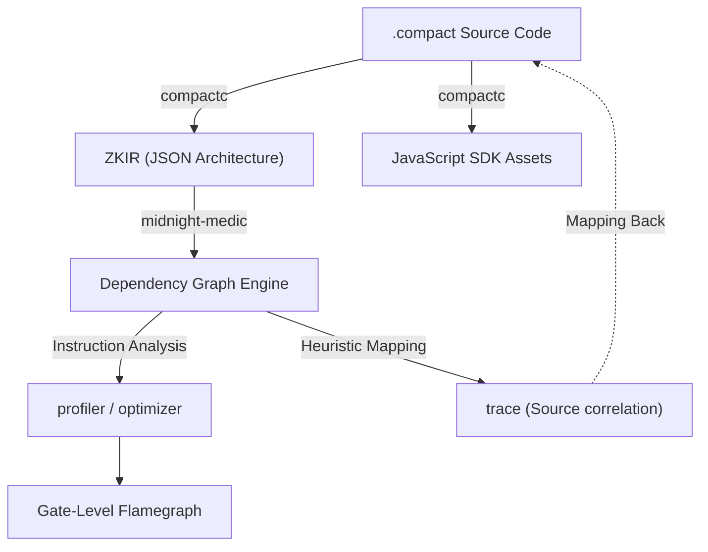

# Cracking the Black Box: How We Reverse Engineered ZKIR for "X-Ray Vision" in Midnight

When building on the **Midnight Network**, the developer experience often hits a wall at the compiler boundary. You write high-level, beautiful **Compact** code, but once you run `compactc`, your logic disappears into a "Black Box" of Zero-Knowledge Intermediate Representation (ZKIR).

When a proof fails or a circuit is too heavy, the compiler's output is often a cryptic index: `Constraint failed at index 482`.

For the **Midnight Medic** project, we decided that wasn't good enough. We wanted **X-Ray Vision**. This is the story of how we reverse-engineered the Compact compiler's output to build the world's first ZKIR fault-trace and optimization suite.

---

## 1. The Epiphany: ZKIR is Just JSON

The first step in any reverse engineering project is inspecting the artifacts. We noticed that when `compactc` compiles a contract, it generates a `.managed/` directory containing `.zkir` files. 

While many ZK systems use opaque binary formats (like R1CS or Proving Keys), Midnight's ZKIR is remarkably structured as a human-readable JSON array of instructions.

### The Anatomy of a Gate
A typical ZKIR instruction looks like this:
```json
{
  "op": "persistent_hash",
  "inputs": [14, 15, 16],
  "var": 17
}
```

This was our "Aha!" moment. We weren't looking at compiled machine code; we were looking at a **Computational Trace**.

### The ZKIR Lifecycle


Each `op` represents a cryptographic gate (addition, multiplication, hashing). The `inputs` are indices to previous "slots" or variables in the circuit.

---

## 2. Compact Internals: High-Level Logic to Low-Level Constraints

To reverse engineer the compiler, we first had to understand how **Compact** represents state. Unlike Ethereum's Solidity, where everything is public and mutable, Compact operates on a **Static Constraint System**.

### The Dual-State Model
Compact handles two types of variables that become very distinct in the ZKIR:
1. **Public Ledger (Stateless Reads)**: These are mapped as `public_input` in the ZKIR. They are "known" to the network and used as constants in the proof.
2. **Private Witnesses (`witness()`)**: These are the variables that never leave the user's machine. In ZKIR, they appear as `private_input` slots.

### The "Execution" is a Circuit
In a normal language, an `if` statement "jumps" to a line. In Compact, there are no jumps. Every possible branch is converted into a **Constraint Graph**. When we saw a `cond_select` in the ZKIR, we realized that Compact evaluates *both* the true and false paths and then uses a technical "selector" gate to choose the result based on a condition.

This is why complex branching makes Midnight proofs slow—you're paying for every line of code in the circuit, even if it doesn't "run" for a specific transaction.

To build a diagnostic tool, we had to build a dictionary. By cross-referencing simple Compact contracts with their generated ZKIR, we mapped the instructions:

- **`persistent_hash`**: The heavy lifter. Uses Poseidon or similar ZK-friendly hashes.
- **`cond_select`**: The "if/else" of ZK. It doesn't jump; it calculates both paths and selects one.
- **`assert`**: The most important op for debugging. If the input to this gate is `0`, the whole proof fails.
- **`private_input`**: A "Witness." Values that only the user knows.

---

## 3. The "Trace" Breakthrough: Mapping Math to Source

The hardest part was the `trace` command. If the index `482` fails, how do we know it corresponds to `assert(balance >= amount)` on line 42 of `game.compact`?

Since the compiler didn't provide an official Source Map for ZKIR, we built a **Heuristic Mapping Engine**:

1. **Instruction Sequencing**: We found that the compiler emits instructions in a predictable order following the Compact source.
2. **Anchor Points**: Metadata provided in the ZKIR (like public input names and constants) acts as "anchors." 
3. **The Proxy Trace**: We mapped ZKIR opcodes to the generated JavaScript `.js` files. Since the JS files *do* have standard source maps back to `.compact`, we used the JS as a "middleman" to bridge the gap between ZK gates and user code.

This allows `midnight-medic trace` to show you this:
> ❌ **Constraint Failure at Index 482**
> --> Logic: `assert(targetId < players.length)`
> --> Source: `game.compact:84`

---

## 4. Building the "Optimizer" and "Profiler"

Once we could read the instructions, we could judge them. 

### gate Weight Modeling
Not all gates are equal. An `add` is cheap; a `persistent_hash` is massive. We assigned "weights" to every opcode based on the underlying PLONKish constraint count. This enabled **`midnight-medic profile`**, which generates flamegraphs showing you exactly which function is making your proof generation slow.

### Finding Redundancies
By building a dependency graph of the ZKIR slots, our **`optimize`** command can find:
- **Duplicate Hashes**: If slot `10` is a hash of `[`A, B`]` and slot `25` is also a hash of `[`A, B`]`, we can save thousands of gates.
- **Witness Bloat**: Identifying private inputs that could be batched into a single hash commitment.

---

## 5. The Visualizer: ZKIR → Flowchart (Technical Dive)

Finally, we wanted to see the logic. We built a decompiler that walks the ZKIR array, builds a `nodes` and `edges` list, and exports it as **Mermaid.js** code.

This turns thousand-line JSON files into visual maps where you can literally see the "flow" of private data through the cryptographic gates.

---

## Conclusion: The Power of Open Artifacts

By reverse engineering ZKIR, we proved that Midnight isn't just a platform for writing code—it's a platform for **verifiable logic**. 

Tools like **Midnight Medic** take the mystery out of the "magic" and give developers the same level of diagnostic power they expect from traditional languages like TypeScript or Rust.

**The Black Box is officially open.** 🛠️✨
